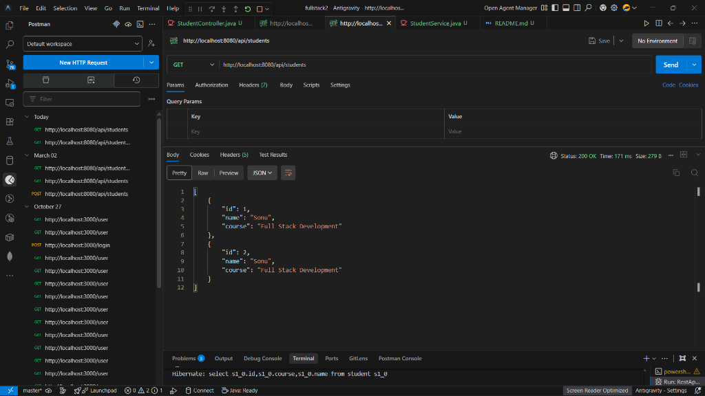
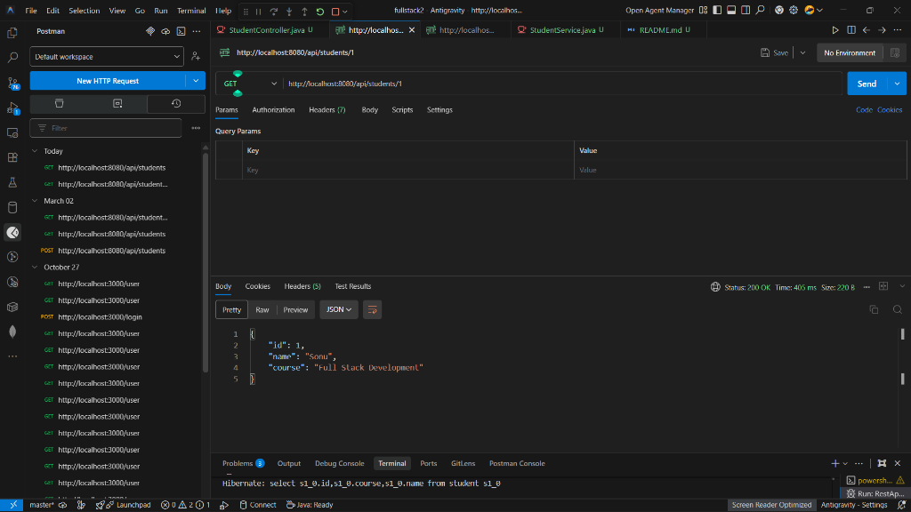
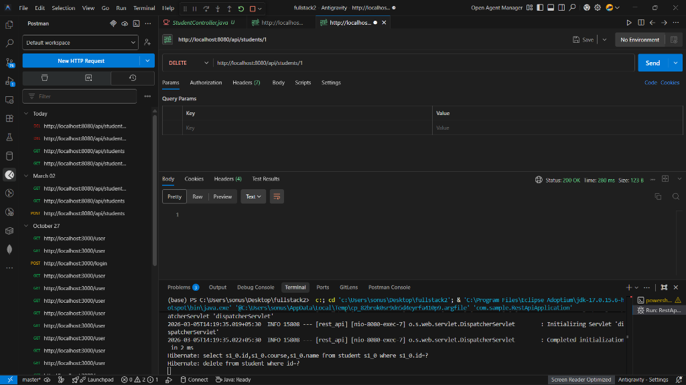

# Student Management REST API

A simple Spring Boot REST API for managing student records.

## Features
- Create, Read, and Delete student records.
- Persistence using MySQL and Spring Data JPA.
- Standard RESTful endpoints.

## Tech Stack
- **Framework:** Spring Boot 3.4.3
- **Language:** Java 17
- **Database:** MySQL
- **Build Tool:** Maven

## Getting Started

### Prerequisites
- Java 17 or higher
- MySQL Server
- Maven (optional, wrapper included)

### Configuration
Update the `src/main/resources/application.properties` file with your MySQL credentials if they differ:
```properties
spring.datasource.url=jdbc:mysql://localhost:3306/student_db?createDatabaseIfNotExist=true
spring.datasource.username=root
spring.datasource.password=your_password
```

### Running the Application
Use the Maven wrapper to run the application:
```bash
./mvnw spring-boot:run
```

The server will start on `http://localhost:8080`.

## API Endpoints

| Method | Endpoint | Description |
| :--- | :--- | :--- |
| **GET** | `/api/students` | Get all students |
| **GET** | `/api/students/{id}` | Get student by ID |
| **POST** | `/api/students` | Add a new student |
| **DELETE** | `/api/students/{id}` | Delete a student |

### Sample JSON Request (POST)
```json
{
  "id": 1,
  "name": "John Doe",
  "course": "Computer Science"
}
```

## Screenshots

### 1. Get All Students


### 2. Get Student by ID


### 3. Delete Student


## Project Structure
- `com.sample.model`: Entity class (`Student`)
- `com.sample.repository`: JPA Repository
- `com.sample.service`: Business logic
- `com.sample.controller`: REST Controllers
